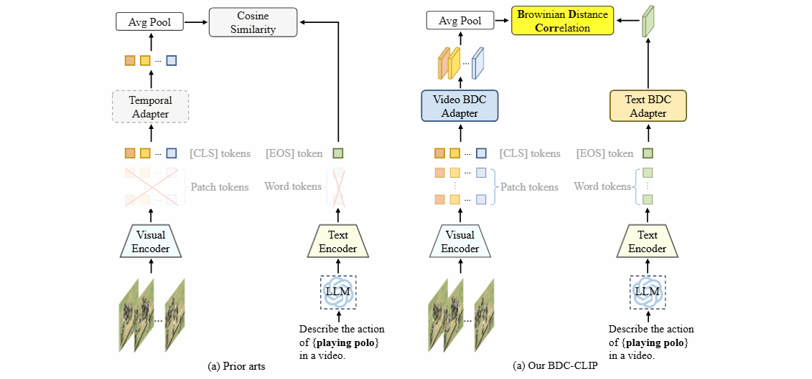

# BDC-CLIP: Brownian Distance Covariance for Adapting CLIP to Action Recognition

[](https://icml.cc/Conferences/2025)[](LICENSE)

<p align="center">
  
</p>

### This repository provides the official implementation of the paper:

> **BDC-CLIP: Brownian Distance Covariance for Adapting CLIP to Action Recognition**
> Fei Long\*, Xiaoou Li\*, Jiaming Lv\*, Haoyuan Yang, Xianjun Cheng, Peihua Li. *ICML 2025 (Poster)*
<p>
  <a href="https://openreview.net/pdf?id=fjXcRSfyIV" style="text-decoration: none;">
    
  </a>
  <a href="link_to_project" style="text-decoration: none;">
    
  </a>
  <a href="https://icml.cc/media/PosterPDFs/ICML%202025/44508.png?t=1750833676.5123641" style="text-decoration: none;">
    
  </a>
  <a href="link_to_video" style="text-decoration: none;">
    
  </a>
</p>

## 📌 Introduction

In this paper, we propose **BDC-CLIP** for action recognition, a novel framework that leverages **Brownian Distance Covariance (BDC)** to enhance video-language alignment. Unlike prior methods that rely on cosine similarity between global tokens-limiting their ability to capture complex dependencies-BDC-CLIP models both **linear and nonlinear** relationships across all visual and textual tokens. This enables fine-grained alignment in space, time, and language, which is crucial for understanding dynamic human actions. BDC-CLIP achieves state-of-the-art performance in zero-shot, few-shot, base-to-novel, and fully supervised settings, demonstrating its effectiveness and generality.

## ✨ Highlights

* **New metric for multimodal alignment:** Introduces BDC as an alternative to cosine similarity, capturing complex statistical dependencies for more fine-grained alignment.
* **Temporal BDC Attention:** Propose a temporal BDC attention that captures patch-wise importance and temporal dynamics.
* **Strong generalization capability:** Achieves state-of-the-art results in zero-shot, few-shot, base-to-novel, and fully-supervised video recognition.

## 🏗️ Project Structure

```bash
BDC_CLIP/
├── assets/             # svg figures for README.md
├── clip/               # CLIP model implementation  
├── configs/            # Configuration files for different experimental settings  
├── datasets/           # Dataset loaders and preprocessing pipeline  
├── datasets_splits/    # Dataset splits for various evaluation protocols  
├── labels/             # Label lists for each dataset under different settings  
├── prompts/            # Prompts generated by LLMs for each dataset  
├── scripts/            # Training and evaluation scripts  
├── trainers/           # Core training modules implementing our methods  
├── utils/              # Utility functions and helper tools  
├── main.py             # Entry point for training and evaluation  
├── README.md           # Project documentation  
└── requirements.txt    # Python dependencies
```

## 🚀 Getting Started

### 🪜 Environment Setup

```bash
conda create -n bdc_clip python=3.10
conda activate bdc_clip
pip install -r requirements.txt
```

💻 Our experiments were conducted using two NVIDIA RTX 4090 GPUs.
⚠️ ***We strongly recommend following our environment setup! Note that differences in hardware (e.g., GPU type) or software (e.g., Pytorch version) may lead to inconsistent results.***


### 🪜 Dataset Preparation

Supported datasets:

```bash
* Kinetics-400
* Kinetics-600
* UCF-101
* HMDB-51
* Something-Something V2
```

Please follow the instructions provide by [TC_CLIP](https://github.com/naver-ai/tc-clip)  for data preparation.

### 🪜 Training & Evaluation


```bash
# Modefied the daset path in configs

# Pretraining on Kinetics-400 (zero-shot)
cd scripts/pre_training
bash zero_shot_pretrain.sh

# Zero-shot evaluation
cd scripts/zero_shot
bash zero_shot_hmdb51.sh
```

## 📊 Results


<h3 style="font-size: 1.4em; font-weight: 500; margin-bottom: 1em;">
  💥 Zero-shot Classification
</h3>

<table style="
  width: 100%;
  border-collapse: collapse;
  font-family: 'Segoe UI', sans-serif;
  font-size: 15px;
  color: #222;
  margin-left: 0;
">
  <colgroup>
    <col style="width: 20%;">
    <col style="width: 20%;">
    <col style="width: 20%;">
    <col style="width: 20%;"> <!-- HM 调宽 -->
    <col style="width: 20%;"> <!-- Model -->
  </colgroup>

  <thead style="background-color: #f6f6f6;">
    <tr>
      <th style="padding: 10px; text-align: center; border: 1px solid #ddd;">Setting</th>
      <th style="padding: 10px; text-align: center; border: 1px solid #ddd;">HMDB-51</th>
      <th style="padding: 10px; text-align: center; border: 1px solid #ddd;">UCF-101</th>
      <th style="padding: 10px; text-align: center; border: 1px solid #ddd;">K600</th>
      <th style="padding: 10px; text-align: center; border: 1px solid #ddd;">Model</th>
    </tr>
  </thead>
  <tbody>
    <tr>
      <td style="text-align: center; padding: 10px; border: 1px solid #ddd;">w/o WSE</td>
      <td style="text-align: center; padding: 10px; border: 1px solid #ddd;">59.4</td>
      <td style="text-align: center; padding: 10px; border: 1px solid #ddd;">85.9</td>
      <td style="text-align: center; padding: 10px; border: 1px solid #ddd;">76.5</td>
      <td style="text-align: center; padding: 10px; border: 1px solid #ddd;" rowspan="2">
        <a href="https://maildluteducn-my.sharepoint.com/:u:/g/personal/longfei121_mail_dlut_edu_cn/ESoWWhkhkqVArb_Ee9H5JH4BcmfSgxZOQ-bm3To-eAlRFQ?e=quVui5" target="_blank" style="color: #1a73e8; text-decoration: none;"><u>OneDrive<u></a> <br>
        <a href="https://pan.baidu.com/s/16jgWXmYgIGKR8TwLmkVczQ?pwd=pi59" target="_blank" style="color: #1a73e8; text-decoration: none;"><u>Baiduyun<u></a>
      </td>
    </tr>
    <tr>
      <td style="text-align: center; padding: 10px; border: 1px solid #ddd;">w WSE</td>
      <td style="text-align: center; padding: 10px; border: 1px solid #ddd;">60.7</td>
      <td style="text-align: center; padding: 10px; border: 1px solid #ddd;">86.9</td>
      <td style="text-align: center; padding: 10px; border: 1px solid #ddd;">78.9</td>
    </tr>
  </tbody>
</table>


<h3 style="font-size: 1.4em; font-weight: 500; margin-bottom: 1em;">
  💥 Few-shot Classification (Pretrained on Kinetics-400)
</h3>

<table style="
  width: 100%;
  border-collapse: collapse;
  font-family: 'Segoe UI', sans-serif;
  font-size: 15px;
  color: #222;
  margin-left: 0;
">
  <colgroup>
    <col style="width: 12%;">
    <col style="width: 12%;">
    <col style="width: 12%;">
    <col style="width: 12%;"> <!-- HM 调宽 -->
    <col style="width: 12%;"> <!-- Model -->
    <col style="width: 20%;"> <!-- Model -->
    <col style="width: 20%;"> <!-- Model -->
  </colgroup>

  <thead style="background-color: #f6f6f6;">
    <tr>
      <th style="padding: 10px; text-align: center; border: 1px solid #ddd;">Dataset</th>
      <th style="padding: 10px; text-align: center; border: 1px solid #ddd;">2-shot</th>
      <th style="padding: 10px; text-align: center; border: 1px solid #ddd;">4-shot</th>
      <th style="padding: 10px; text-align: center; border: 1px solid #ddd;">8-shot</th>
      <th style="padding: 10px; text-align: center; border: 1px solid #ddd;">16-shot</th>
      <th style="padding: 10px; text-align: center; border: 1px solid #ddd;">Pretrained Model</th>
      <th style="padding: 10px; text-align: center; border: 1px solid #ddd;">Finetuned Model</th>
    </tr>
  </thead>
  <tbody>
    <tr>
      <td style="text-align: center; padding: 10px; border: 1px solid #ddd;"><strong>HMDB-51</strong></td>
      <td style="text-align: center; padding: 10px; border: 1px solid #ddd;">68.0</td>
      <td style="text-align: center; padding: 10px; border: 1px solid #ddd;">71.5</td>
      <td style="text-align: center; padding: 10px; border: 1px solid #ddd;">75.9</td>
      <td style="text-align: center; padding: 10px; border: 1px solid #ddd;">77.3</td>
           <td rowspan="3" style="text-align: center; vertical-align: middle; padding: 10px; border: 1px solid #ddd;">
        <div style="margin-bottom: 10px;">
          <a href="https://maildluteducn-my.sharepoint.com/:u:/g/personal/longfei121_mail_dlut_edu_cn/ESnsy7kV3xZMlNDbbpmG420BvnI3gFXrnp4EfeBtDOztsA?e=wQtzDf" target="_blank" style="color: #1a73e8; text-decoration: none;"><u>OneDrive</u></a><br>
          <a href="https://pan.baidu.com/s/10khYaB67RQnNY9GLfcugSA?pwd=7vtm" target="_blank" style="color: #1a73e8; text-decoration: none;"><u>Baiduyun</u></a>
        </div>
      </td>
      <td style="text-align: center; padding: 10px; border: 1px solid #ddd;">
        <a href="https://maildluteducn-my.sharepoint.com/:u:/g/personal/longfei121_mail_dlut_edu_cn/EVJtf6IH4n1Ds8Wvq0lYtIkBdMyUXsSPLjuyx2NmnEX2Sg?e=Te6A8g" target="_blank" style="color: #1a73e8; text-decoration: none;"><u>OneDrive<u></a> <br>
        <a href="https://pan.baidu.com/s/1_U3Vw0AOaWAMt1fCtEf4kQ?pwd=sgbe" target="_blank" style="color: #1a73e8; text-decoration: none;"><u>Baiduyun<u></a>
      </td>
    </tr>
    <tr>
      <td style="text-align: center; padding: 10px; border: 1px solid #ddd;"><strong>UCF-101</strong></td>
      <td style="text-align: center; padding: 10px; border: 1px solid #ddd;">94.9</td>
      <td style="text-align: center; padding: 10px; border: 1px solid #ddd;">96.7</td>
      <td style="text-align: center; padding: 10px; border: 1px solid #ddd;">97.5</td>
      <td style="text-align: center; padding: 10px; border: 1px solid #ddd;">98.5</td>
      <td style="text-align: center; padding: 10px; border: 1px solid #ddd;">
        <a href="https://maildluteducn-my.sharepoint.com/:u:/g/personal/longfei121_mail_dlut_edu_cn/ESfPds1Tsd5EhvLXj_euzhkBWb6DDJGXM3OMMNi_2lXnog?e=oamAjk" target="_blank" style="color: #1a73e8; text-decoration: none;"><u>OneDrive<u></a> <br>
        <a href="https://pan.baidu.com/s/1-C7QqyAvPmC_OKi_ut_Axw?pwd=cais" target="_blank" style="color: #1a73e8; text-decoration: none;"><u>Baiduyun<u></a>
      </td>
    </tr>
    <tr>
      <td style="text-align: center; padding: 10px; border: 1px solid #ddd;"><strong>SSv2</strong></td>
      <td style="text-align: center; padding: 10px; border: 1px solid #ddd;">9.9</td>
      <td style="text-align: center; padding: 10px; border: 1px solid #ddd;">11.6</td>
      <td style="text-align: center; padding: 10px; border: 1px solid #ddd;">14.4</td>
      <td style="text-align: center; padding: 10px; border: 1px solid #ddd;">19.5</td>
      <td style="text-align: center; padding: 10px; border: 1px solid #ddd;">
        <a href="https://maildluteducn-my.sharepoint.com/:u:/g/personal/longfei121_mail_dlut_edu_cn/EaUth8YTawVBk7vzWgV7xKEB9Sn0qHa5BWocwt5pBvf_GA?e=OH3pOi" target="_blank" style="color: #1a73e8; text-decoration: none;"><u>OneDrive<u></a> <br>
        <a href="https://pan.baidu.com/s/11XfpB1neGLQv5JwLO8ug1g?pwd=e3gq" target="_blank" style="color: #1a73e8; text-decoration: none;"><u>Baiduyun<u></a>
      </td>
    </tr>
  </tbody>
</table>


<h3 style="font-size: 1.4em; font-weight: 500; margin-bottom: 1em;">
  💥 Base-to-novel Classification (Pretrained on Kinetics-400)
</h3>

<table style="
  width: 80%;
  border-collapse: collapse;
  font-family: 'Segoe UI', sans-serif;
  font-size: 15px;
  color: #222;
  margin-left: 0;
">
  <!-- 设置列宽比例 -->
  <colgroup>
    <col style="width: 13%;">
    <col style="width: 13%;">
    <col style="width: 13%;">
    <col style="width: 13%;"> <!-- HM 调宽 -->
    <col style="width: 24%;"> <!-- Model -->
    <col style="width: 24%;"> <!-- Model -->
  </colgroup>

  <thead style="background-color: #f6f6f6;">
    <tr>
      <th style="padding: 10px; text-align: center; border: 1px solid #ddd;">Dataset</th>
      <th style="padding: 10px; text-align: center; border: 1px solid #ddd;">Base</th>
      <th style="padding: 10px; text-align: center; border: 1px solid #ddd;">Novel</th>
      <th style="padding: 10px; text-align: center; border: 1px solid #ddd;">HM</th>
      <th style="padding: 10px; text-align: center; border: 1px solid #ddd;">Pretrained Model</th>
      <th style="padding: 10px; text-align: center; border: 1px solid #ddd;">Finetuned Model</th>
    </tr>
  </thead>
  <tbody>
    <tr>
      <td style="text-align: center; padding: 10px; border: 1px solid #ddd;"><strong>HMDB-51</strong></td>
      <td style="text-align: center; padding: 10px; border: 1px solid #ddd;">81.0</td>
      <td style="text-align: center; padding: 10px; border: 1px solid #ddd;">61.3</td>
      <td style="text-align: center; padding: 10px; border: 1px solid #ddd;">69.8</td>
      <td rowspan="3" style="text-align: center; vertical-align: middle; padding: 10px; border: 1px solid #ddd;">
        <div style="margin-bottom: 10px;">
          <a href="https://maildluteducn-my.sharepoint.com/:u:/g/personal/longfei121_mail_dlut_edu_cn/ESnsy7kV3xZMlNDbbpmG420BvnI3gFXrnp4EfeBtDOztsA?e=wQtzDf" target="_blank" style="color: #1a73e8; text-decoration: none;"><u>OneDrive</u></a><br>
          <a href="https://pan.baidu.com/s/10khYaB67RQnNY9GLfcugSA?pwd=7vtm" target="_blank" style="color: #1a73e8; text-decoration: none;"><u>Baiduyun</u></a>
        </div>
      </td>
      <td style="text-align: center; padding: 10px; border: 1px solid #ddd;">
        <a href="https://maildluteducn-my.sharepoint.com/:u:/g/personal/longfei121_mail_dlut_edu_cn/EeQ1jMq6FRRPr8bxcuE2v9UBAQgp6yXj83XYbGxU9gvfFA?e=WqAkK9" target="_blank" style="color: #1a73e8; text-decoration: none;"><u>OneDrive</u></a> <br>
        <a href="https://pan.baidu.com/s/1S294wHQAzzXxi-oNkeMm7g?pwd=vyyw" target="_blank" style="color: #1a73e8; text-decoration: none;"><u>Baiduyun</u></a>
      </td>
    </tr>
    <tr>
      <td style="text-align: center; padding: 10px; border: 1px solid #ddd;"><strong>UCF-101</strong></td>
      <td style="text-align: center; padding: 10px; border: 1px solid #ddd;">97.5</td>
      <td style="text-align: center; padding: 10px; border: 1px solid #ddd;">88.0</td>
      <td style="text-align: center; padding: 10px; border: 1px solid #ddd;">92.5</td>
      <td style="text-align: center; padding: 10px; border: 1px solid #ddd;">
        <a href="https://maildluteducn-my.sharepoint.com/:u:/g/personal/longfei121_mail_dlut_edu_cn/EUcBRT6kI_JMhs1wo4NUJJMBdKuc7h7A1MpeaV2Mvc3ngg?e=1Dmgp7" target="_blank" style="color: #1a73e8; text-decoration: none;"><u>OneDrive</u></a> <br>
        <a href="https://pan.baidu.com/s/1BGTMtIejK87oS6Ar-kZ_cg?pwd=dkuz" target="_blank" style="color: #1a73e8; text-decoration: none;"><u>Baiduyun</u></a>
      </td>
    </tr>
    <tr>
      <td style="text-align: center; padding: 10px; border: 1px solid #ddd;"><strong>SSv2</strong></td>
      <td style="text-align: center; padding: 10px; border: 1px solid #ddd;">20.9</td>
      <td style="text-align: center; padding: 10px; border: 1px solid #ddd;">18.2</td>
      <td style="text-align: center; padding: 10px; border: 1px solid #ddd;">19.5</td>
      <td style="text-align: center; padding: 10px; border: 1px solid #ddd;">
        <a href="https://maildluteducn-my.sharepoint.com/:u:/g/personal/longfei121_mail_dlut_edu_cn/EbRJN6cSKxdBvJs7xjCPjYUB6n30FolGJVdwObVH96SUJQ?e=3ib8Tl" target="_blank" style="color: #1a73e8; text-decoration: none;"><u>OneDrive</u></a> <br>
        <a href="https://pan.baidu.com/s/1s6pVR601yQzxIYmBC_1TVQ?pwd=p59c" target="_blank" style="color: #1a73e8; text-decoration: none;"><u>Baiduyun</u></a>
      </td>
    </tr>
  </tbody>
</table>

## 📋 Citation

If you find this work useful, please consider citing:

```Bibtex
@inproceedings{long2025bdcclip,
  title     = {BDC-CLIP: Brownian Distance Covariance for Adapting CLIP to Action Recognition},
  author    = {Fei Long and Xiaoou Li and Jiaming Lv and Haoyuan Yang and Xianjun Cheng and Peihua Li},
  booktitle = {International Conference on Machine Learning (ICML)},
  year      = {2025}
}
```

## 🌟 Acknowledgments

Our project is partially based on the open-source projects [ViFiCLIP](https://github.com/muzairkhattak/ViFi-CLIP), [TC_CLIP](https://github.com/naver-ai/tc-clip), and [FROSTER](https://github.com/Visual-AI/FROSTER). We sincerely acknowledge their contributions.

## 📬 Contact

If you have any questions or suggestions, feel free to contact: <br>
 Fei Long: [longfei121@mail.dlut.edu.cn](mailto:peihuali@dlut.edu.cn)

